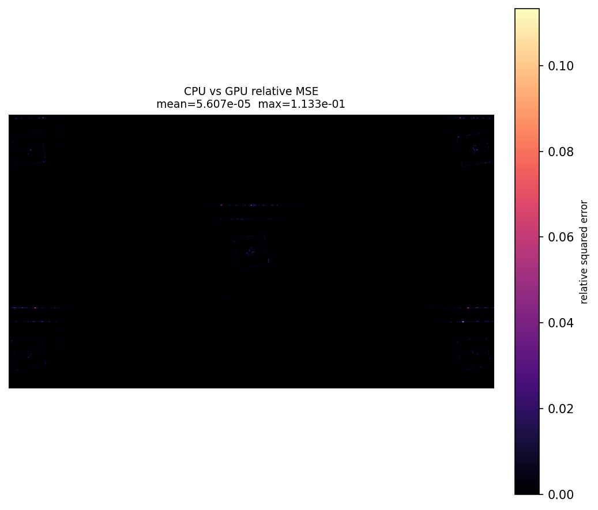

# Laborbericht: PBRT CPU/GPU E2E Experiment

## Konfiguration

| Parameter | Wert |
|---|---|
| Run directory | `/home/marcel/GitRepositories/Experiments/runs/pbrt-cpu-gpu-e2e/2026-05-25_21-43-25-f31d9f0` |
| Datum/Zeit | `2026-05-25T21:43:25` |
| Scene | `/home/marcel/GitRepositories/Experiments/assets/slanted-edge-target/rossinterpolatedpsf_low.pbrt` |
| Scene copy | `/home/marcel/GitRepositories/Experiments/runs/pbrt-cpu-gpu-e2e/2026-05-25_21-43-25-f31d9f0/rossinterpolatedpsf_low.pbrt` |
| Seed | `1234` |
| SPP | `1` |
| PBRT binary | `/home/marcel/GitRepositories/ROSS/build/pbrt-v4/pbrt` |
| PBRT SHA256 | `674b179e024d6cfcd438061ef594aced99c5ff38d7d7513cd140dc78c2e10f01` |
| Git commit | `f31d9f0588f58ae65f7142c12eef350d59055735` |
| Git branch | `psf-interpolation` |
| Python | `3.12.13 (main, Mar 24 2026, 22:49:22) [Clang 22.1.1 ]` |
| Platform | `Linux-7.0.8-200.fc44.x86_64-x86_64-with-glibc2.39` |
| Determinismus-Grenzwert | `0.0` |
| CPU/GPU-Grenzwert | `0.1` |
| Diff colormap | `magma` |

---

## Grund für das Experiment

<!--
Warum wurde dieses Experiment durchgeführt?
Welche Frage soll beantwortet werden?
-->

---

## Hypothese / Erwartung

<!--
Was wird erwartet?
-->

---

## Beobachtungen

---

## Notizen

---

## Ergebnisse

| Metrik | Wert | Grenzwert | Status |
|---|---:|---:|---|
| CPU vs CPU rel. MSE | `0.000000e+00` | `0.000000e+00` | PASS |
| GPU vs GPU rel. MSE | `0.000000e+00` | `0.000000e+00` | PASS |
| CPU vs GPU rel. MSE | `5.607226e-05` | `1.000000e-01` | PASS |
| CPU vs CPU max rel. pixel error | `0.000000e+00` | — | — |
| GPU vs GPU max rel. pixel error | `0.000000e+00` | — | — |
| CPU vs GPU max rel. pixel error | `1.132654e-01` | — | — |
| Image shape | `[3, 1088, 1928]` | — | — |

**Gesamtstatus:** PASS

### Renderzeiten

| Render | Modus | Sekunden |
|---|---|---:|
| GPU A | GPU | `18.524` |
| GPU B | GPU | `16.542` |
| CPU A | CPU | `268.090` |
| CPU B | CPU | `285.209` |
| GPU Durchschnitt | GPU | `17.533` |
| CPU Durchschnitt | CPU | `276.649` |

| Vergleich | Multiplikator | Prozent schneller | Zeitersparnis |
|---|---:|---:|---:|
| Durchschnitt CPU/GPU | `15.779x` | `1477.9%` | `93.7%` |
| A CPU/GPU | `14.472x` | `1347.2%` | `93.1%` |
| B CPU/GPU | `17.241x` | `1624.1%` | `94.2%` |

Die gleichen Werte stehen maschinenlesbar in `render_times.csv`.

### Relative-MSE-Diff-Bilder

| Vergleich | Bild |
|---|---|
| CPU vs CPU | `outputs/diff_cpu_vs_cpu.png` |
| GPU vs GPU | `outputs/diff_gpu_vs_gpu.png` |
| CPU vs GPU | `outputs/diff_cpu_vs_gpu.png` |

---

## Interpretation

<!--
Was bedeuten die Ergebnisse?
Sind die Abweichungen plausibel?
Wurde die Hypothese bestätigt oder widerlegt?
-->

---

## Fazit

<!--
Kurze Zusammenfassung:
- Bestanden / fehlgeschlagen?
- Wichtigste Erkenntnis?
- Nächste Schritte?
-->

---

## Nächste Schritte

<!--
TODOs, Folgeexperimente oder Debugging-Ideen.
-->

- [ ]
- [ ]
- [ ]
