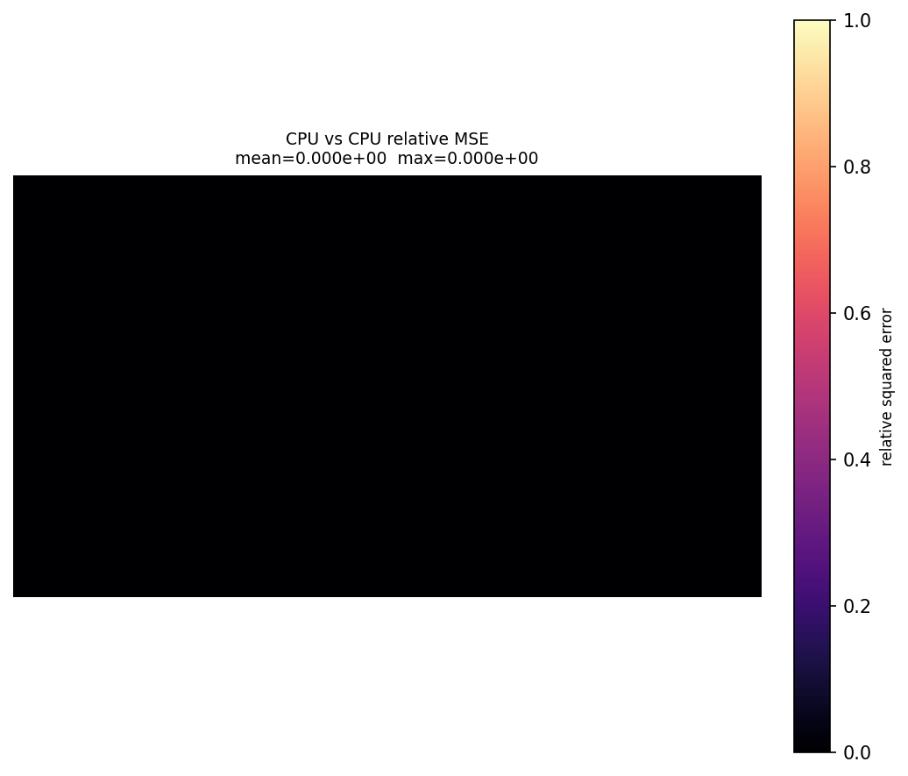
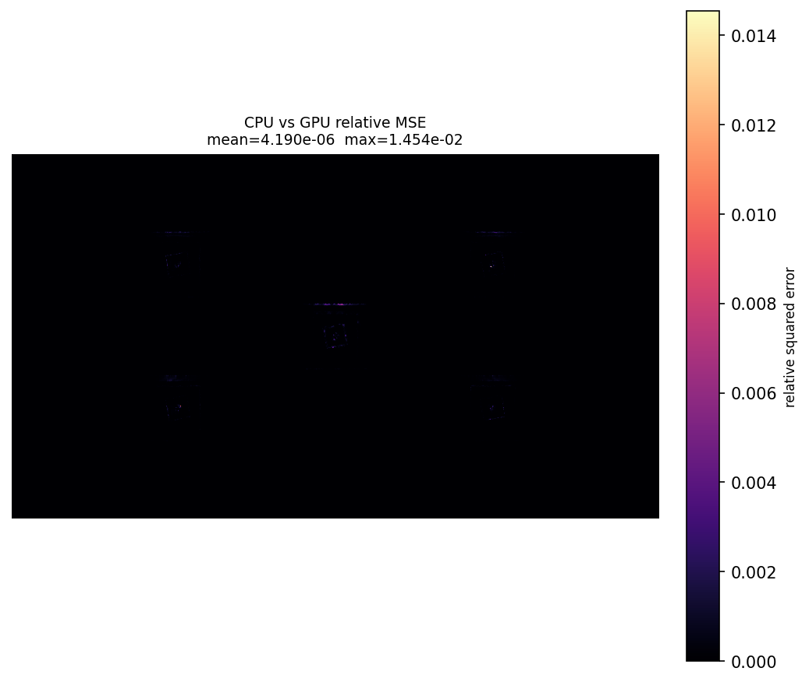

# Laborbericht: PBRT CPU/GPU E2E Experiment

## Konfiguration

| Parameter | Wert |
|---|---|
| Run directory | `/home/marcel/GitRepositories/Experiments/runs/pbrt-cpu-gpu-e2e/2026-05-27_12-02-13-b9f3fb4` |
| Datum/Zeit | `2026-05-27T12:02:13` |
| Scene | `/home/marcel/GitRepositories/Experiments/assets/scenes/slanted-edge-target/rossinterpolatedpsf_lg_innotek_31x18.pbrt` |
| Scene copy | `/home/marcel/GitRepositories/Experiments/runs/pbrt-cpu-gpu-e2e/2026-05-27_12-02-13-b9f3fb4/rossinterpolatedpsf_lg_innotek_31x18.pbrt` |
| Seed | `1234` |
| SPP | `1` |
| PBRT binary | `/home/marcel/GitRepositories/ROSS/build/pbrt-v4/pbrt` |
| PBRT SHA256 | `3ca00652f40faecbb9c5ce8d9894d93aea9a83648e72d7905c174385060d2fb5` |
| Git commit | `b9f3fb4407f4abb1c96a89784b801921782afb1a` |
| Git branch | `psf-interpolation` |
| Python | `3.12.3 (main, Mar 23 2026, 19:04:32) [GCC 13.3.0]` |
| Platform | `Linux-6.17.0-29-generic-x86_64-with-glibc2.39` |
| Determinismus-Grenzwert | `0.0` |
| CPU/GPU-Grenzwert | `0.1` |
| Diff colormap | `magma` |

---

## Grund für das Experiment

<!--
Warum wurde dieses Experiment durchgeführt?
Welche Frage soll beantwortet werden?
-->

---

## Hypothese / Erwartung

<!--
Was wird erwartet?
-->

---

## Beobachtungen

---

## Notizen

---

## Ergebnisse

| Metrik | Wert | Grenzwert | Status |
|---|---:|---:|---|
| CPU vs CPU rel. MSE | `0.000000e+00` | `0.000000e+00` | PASS |
| GPU vs GPU rel. MSE | `0.000000e+00` | `0.000000e+00` | PASS |
| CPU vs GPU rel. MSE | `4.190075e-06` | `1.000000e-01` | PASS |
| CPU vs CPU max rel. pixel error | `0.000000e+00` | — | — |
| GPU vs GPU max rel. pixel error | `0.000000e+00` | — | — |
| CPU vs GPU max rel. pixel error | `1.453941e-02` | — | — |
| Image shape | `[3, 1088, 1928]` | — | — |

**Gesamtstatus:** PASS

### Renderzeiten

| Render | Modus | Sekunden |
|---|---|---:|
| GPU A | GPU | `1.630` |
| GPU B | GPU | `1.424` |
| CPU A | CPU | `26.768` |
| CPU B | CPU | `25.566` |
| GPU Durchschnitt | GPU | `1.527` |
| CPU Durchschnitt | CPU | `26.167` |

| Vergleich | Multiplikator | Prozent schneller | Zeitersparnis |
|---|---:|---:|---:|
| Durchschnitt CPU/GPU | `17.136x` | `1613.6%` | `94.2%` |
| A CPU/GPU | `16.423x` | `1542.3%` | `93.9%` |
| B CPU/GPU | `17.952x` | `1695.2%` | `94.4%` |

Die gleichen Werte stehen maschinenlesbar in `render_times.csv`.

### Relative-MSE-Diff-Bilder

| Vergleich | Bild |
|---|---|
| CPU vs CPU | `outputs/diff_cpu_vs_cpu.png` |
| GPU vs GPU | `outputs/diff_gpu_vs_gpu.png` |
| CPU vs GPU | `outputs/diff_cpu_vs_gpu.png` |

---

## Interpretation

<!--
Was bedeuten die Ergebnisse?
Sind die Abweichungen plausibel?
Wurde die Hypothese bestätigt oder widerlegt?
-->

---

## Fazit

<!--
Kurze Zusammenfassung:
- Bestanden / fehlgeschlagen?
- Wichtigste Erkenntnis?
- Nächste Schritte?
-->

---

## Nächste Schritte

<!--
TODOs, Folgeexperimente oder Debugging-Ideen.
-->

- [ ]
- [ ]
- [ ]
