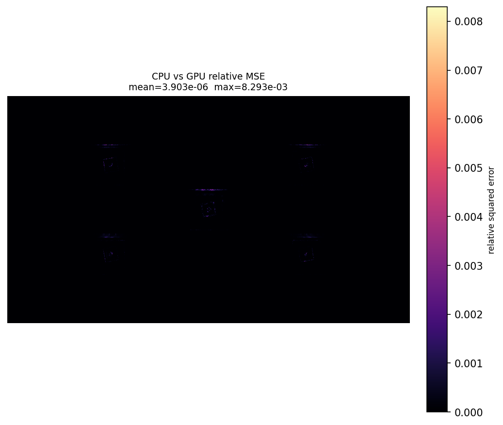

# Laborbericht: PBRT CPU/GPU E2E Experiment

## Konfiguration

| Parameter | Wert |
|---|---|
| Run directory | `/home/marcel/GitRepositories/Experiments/runs/pbrt-cpu-gpu-e2e/2026-05-27_13-33-23-d24ba4f` |
| Datum/Zeit | `2026-05-27T13:33:23` |
| Scene | `/home/marcel/GitRepositories/Experiments/assets/scenes/slanted-edge-target/rossinterpolatedpsf_lg_innotek_31x18.pbrt` |
| Scene copy | `/home/marcel/GitRepositories/Experiments/runs/pbrt-cpu-gpu-e2e/2026-05-27_13-33-23-d24ba4f/rossinterpolatedpsf_lg_innotek_31x18.pbrt` |
| Seed | `1234` |
| SPP | `1` |
| PBRT binary | `/home/marcel/GitRepositories/ROSS/build/pbrt-v4/pbrt` |
| PBRT SHA256 | `076553c64bd1f4914bba7882dee4fe40c38336ed8c3c3e876b7449e87f372f59` |
| Git commit | `d24ba4f1b86b88471b9bfecd4116e1ce150f384b` |
| Git branch | `psf-interpolation` |
| Determinismus-Grenzwert | `0.0` |
| CPU/GPU-Grenzwert | `0.1` |
| Diff colormap | `magma` |

## Scene-Parameter

| Parameter | Wert |
|---|---|
| Integrator class | `path` |
| Sampler class | `independent` |
| Film/sensor class | `rossinterpolatedpsfrgb` |
| Camera class | `perspective` |
| Lens file | `not specified` |
| Sensor file | `not specified` |
| PSF grid | `../../psfs/psf-lg-innotek-5mm-31x18/psf-lg-innotek-5mm-31x18-31x18.json` |
| Film xresolution | `1928` |
| Film yresolution | `1088` |
| Film diagonal | `6.641411898083118` |
| Sampler pixelsamples | `512` |
| CLI SPP override | `1` |

### Integrator

_Keine Werte gefunden._

### Sampler

| Parameter | Wert |
|---|---|
| integer pixelsamples | `512` |

### Film / Sensor

| Parameter | Wert |
|---|---|
| string filename | `rossinterpolatedpsf_lg_innotek_31x18.exr` |
| integer xresolution | `1928` |
| integer yresolution | `1088` |
| float diagonal | `6.641411898083118` |
| string psfgrid | `../../psfs/psf-lg-innotek-5mm-31x18/psf-lg-innotek-5mm-31x18-31x18.json` |

### Camera

| Parameter | Wert |
|---|---|
| float fov | `18.7` |
| rgb L | `1 1 1` |
| string wrap | `repeat` |
| string filename | `slanted_edge_single.png` |
| texture reflectance | `tex` |
| string type | `diffuse` |
| point2 uv | `0 1 1 1 1 0 0 0` |
| normal N | `0 0 1 0 0 1 0 0 1 0 0 1` |
| point3 P | `-1 -1 0 1 -1 0 1 1 0 -1 1 0` |
| integer indices | `2 1 0 3 2 0` |
| point2 uv | `0 1 1 1 1 0 0 0` |
| normal N | `0 0 1 0 0 1 0 0 1 0 0 1` |
| point3 P | `-1 -1 0 1 -1 0 1 1 0 -1 1 0` |
| integer indices | `2 1 0 3 2 0` |
| point2 uv | `0 1 1 1 1 0 0 0` |
| normal N | `0 0 1 0 0 1 0 0 1 0 0 1` |
| point3 P | `-1 -1 0 1 -1 0 1 1 0 -1 1 0` |
| integer indices | `2 1 0 3 2 0` |
| point2 uv | `0 1 1 1 1 0 0 0` |
| normal N | `0 0 1 0 0 1 0 0 1 0 0 1` |
| point3 P | `-1 -1 0 1 -1 0 1 1 0 -1 1 0` |
| integer indices | `2 1 0 3 2 0` |
| point2 uv | `0 1 1 1 1 0 0 0` |
| normal N | `0 0 1 0 0 1 0 0 1 0 0 1` |
| point3 P | `-1 -1 0 1 -1 0 1 1 0 -1 1 0` |
| integer indices | `2 1 0 3 2 0` |

---

## Grund fuer das Experiment

<!--
Warum wurde dieses Experiment durchgefuehrt?
Welche Frage soll beantwortet werden?
-->

---

## Hypothese / Erwartung

<!--
Was wird erwartet?
-->

---

## Beobachtungen

---

## Notizen

---

## Ergebnisse

| Metrik | Wert | Grenzwert | Status |
|---|---:|---:|---|
| CPU vs CPU rel. MSE | `0.000000e+00` | `0.000000e+00` | PASS |
| GPU vs GPU rel. MSE | `0.000000e+00` | `0.000000e+00` | PASS |
| CPU vs GPU rel. MSE | `3.902654e-06` | `1.000000e-01` | PASS |
| CPU vs CPU max rel. pixel error | `0.000000e+00` | — | — |
| GPU vs GPU max rel. pixel error | `0.000000e+00` | — | — |
| CPU vs GPU max rel. pixel error | `8.292952e-03` | — | — |
| Image shape | `[3, 1088, 1928]` | — | — |

**Gesamtstatus:** PASS

### Renderzeiten

| Render | Modus | Sekunden |
|---|---|---:|
| GPU A | GPU | `1.054` |
| GPU B | GPU | `0.856` |
| CPU A | CPU | `16.938` |
| CPU B | CPU | `17.005` |
| GPU Durchschnitt | GPU | `0.955` |
| CPU Durchschnitt | CPU | `16.971` |

| Vergleich | Multiplikator | Prozent schneller | Zeitersparnis |
|---|---:|---:|---:|
| Durchschnitt CPU/GPU | `17.766x` | `1676.6%` | `94.4%` |
| A CPU/GPU | `16.070x` | `1507.0%` | `93.8%` |
| B CPU/GPU | `19.854x` | `1885.4%` | `95.0%` |

### Relative-MSE-Diff-Bilder

| Vergleich | Bild |
|---|---|
| CPU vs CPU | `outputs/diff_cpu_vs_cpu.png` |
| GPU vs GPU | `outputs/diff_gpu_vs_gpu.png` |
| CPU vs GPU | `outputs/diff_cpu_vs_gpu.png` |

---

## Interpretation

<!--
Was bedeuten die Ergebnisse?
Sind die Abweichungen plausibel?
Wurde die Hypothese bestaetigt oder widerlegt?
-->

---

## Fazit

<!--
Kurze Zusammenfassung:
- Bestanden / fehlgeschlagen?
- Wichtigste Erkenntnis?
- Naechste Schritte?
-->

---

## Naechste Schritte

<!--
TODOs, Folgeexperimente oder Debugging-Ideen.
-->

- [ ]
- [ ]
- [ ]
