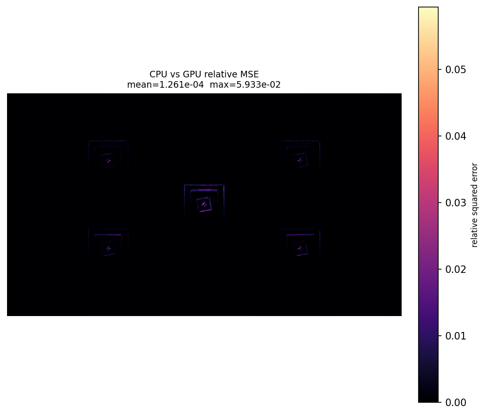

# Laborbericht: PBRT CPU/GPU E2E Experiment

## Konfiguration

| Parameter | Wert |
|---|---|
| Datum/Zeit | `2026-05-27T14:05:15` |
| Git commit | `d24ba4f1b86b88471b9bfecd4116e1ce150f384b` |
| Git branch | `psf-interpolation` |
| Determinismus-Grenzwert | `0.0` |
| CPU/GPU-Grenzwert | `0.1` |

## Scene-Parameter

| Parameter | Wert |
|---|---|
| Integrator class | `path` |
| Sampler class | `independent` |
| Film/sensor class | `rossinterpolatedpsfrgb` |
| Camera class | `perspective` |
| PSF grid | `../../psfs/psf-lg-innotek-5mm-31x18/psf-lg-innotek-5mm-31x18-31x18.json` |
| Film xresolution | `1928` |
| Film yresolution | `1088` |
| Film diagonal | `6.641411898083118` |
| Sampler pixelsamples | `512` |
| SPP | `1` |

---

## Grund fuer das Experiment

<!--
Warum wurde dieses Experiment durchgefuehrt?
Welche Frage soll beantwortet werden?
-->

---

## Hypothese / Erwartung

<!--
Was wird erwartet?
-->

---

## Beobachtungen

---

## Notizen

---

## Ergebnisse

| Render | Modus | Sekunden | Determinismus rel. MSE | CPU/GPU rel. MSE | Determinismus | CPU/GPU | Speedup | Zeitersparnis |
|---|---|---|---|---|---|---|---|---|
| CPU A | CPU | `17.920` | `0.000000e+00` | `1.260851e-04` | PASS | PASS | — | — |
| CPU B | CPU | `17.043` | `0.000000e+00` | — | PASS | — | — | — |
| GPU A | GPU | `1.067` | `0.000000e+00` | `1.260851e-04` | PASS | PASS | `16.797x` | `94.0%` |
| GPU B | GPU | `0.878` | `0.000000e+00` | — | PASS | — | `19.408x` | `94.8%` |
| Durchschnitt | CPU/GPU | `17.482` / `0.973` | — | — | — | — | `17.976x` | `94.4%` |

### Relative-MSE-Diff-Bilder

| Vergleich | Bild |
|---|---|
| CPU vs CPU | `outputs/diff_cpu_vs_cpu.png` |
| GPU vs GPU | `outputs/diff_gpu_vs_gpu.png` |
| CPU vs GPU | `outputs/diff_cpu_vs_gpu.png` |

---

## Interpretation

<!--
Was bedeuten die Ergebnisse?
Sind die Abweichungen plausibel?
Wurde die Hypothese bestaetigt oder widerlegt?
-->

---

## Fazit

<!--
Kurze Zusammenfassung:
- Bestanden / fehlgeschlagen?
- Wichtigste Erkenntnis?
- Naechste Schritte?
-->

---

## Naechste Schritte

<!--
TODOs, Folgeexperimente oder Debugging-Ideen.
-->

- [ ]
- [ ]
- [ ]
